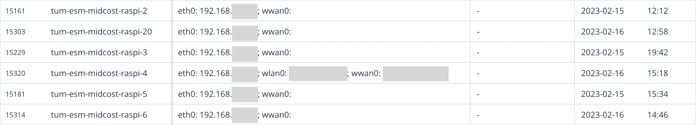

# 🪵 Baserow IP Logger

This tool automatically logs the local IP into a https://baserow.io/ table. We need it because we don't have publicly routed IPs on most of our devices and didn't find a practical way to discover local devices in our big university network yet.

It only pushes updates on changes in the network state or reboot. We decided to omit the public IP for now because this would require a lot of unnecessary additional traffic for our use case. This might be configurable via the `config.json` in the future.

**Example table content:**



<br/>

## ⚡️ How to run it?

1. Install dependencies in a local venv:

```bash
python3.9 -m venv .venv
source .venv/bin/activate
poetry install
```

2. Set up a table on [baserow.io](https://baserow.io/) with the fields `node-identifier`, `local-ip-address` and `public-ip-address`


3. Use `config.template.json` to write a `config.json`

4. Run it manually

```bash
source .venv/bin/activate
python run.py
```

5. Add the following to the crontab to run it periodically

```cron
*/2 * * * * .../baserow-node-ip-management/.venv/bin/python .../baserow-node-ip-management/run.py > .../baserow-node-ip-management/cron.log
```
